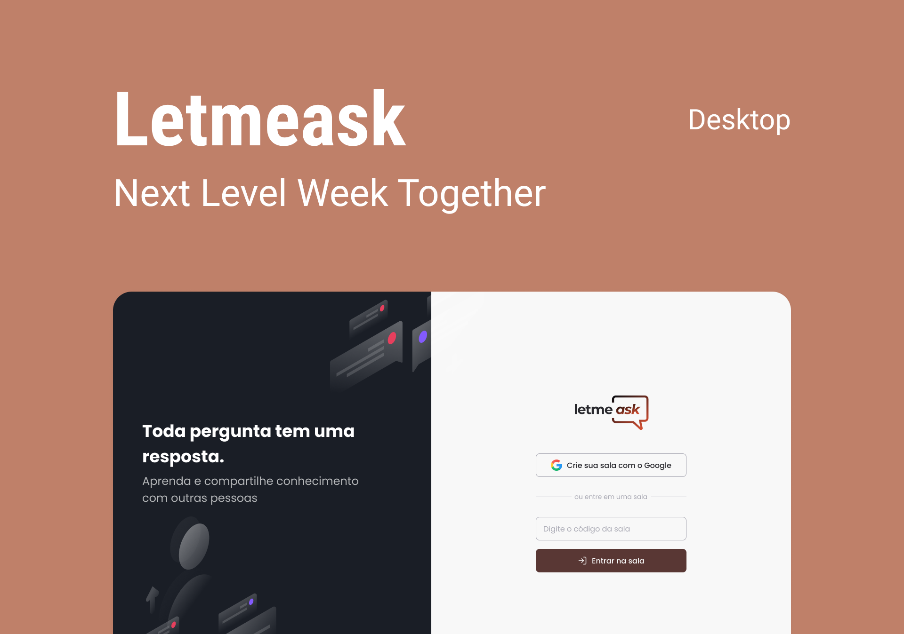

<p align="center">
  
</p>

<p align="center">
  
  
  

     
</p>

<h1 align="center">
    
</h1>

<br>

## 🧪 Tecnologies

This project was designed with the following Tecnologies:

- [ReactJS](https://reactjs.org)
- [Firebase](https://firebase.google.com/)
- [TypeScript](https://www.typescriptlang.org/)

## 🚀 How to run

Clone the project and access the directory.

```bash
$ git clone https://github.com/rafaxtd/letmeask
$ cd letmeask
```

To start:
```bash
# Install dependencies
$ yarn

# Start the project
$ yarn start
```
The app will be available an running at http://localhost:3000.

It is needed an account in [Firebase](https://firebase.google.com/) and a project to use Realtime Database from Google.

## 💻 Project

Letmeask was designed by Rocketseat to avoid question flood in live sessions in any streaming platform as Youtube, Twitch, etc. 

It helps the host to merge questions and select the on which is the most evaluated, answer and delete them in the order they come.

This project was developed during the **[Next Level Week Together](https://nextlevelweek.com/)**, June 2021.


## 🔖 Layout

You can check the layout below.

- [Layout Web](https://www.figma.com/file/u0BQK8rCf2KgzcukdRRCWh/Letmeask/duplicate) 

It is needed a [Figma](http://figma.com/) account.

## 📝 License

License MIT. You can check the details here - [LICENSE](LICENSE.md) 

---

Made with 💜 by Rocketseat and executed by me with love as well.